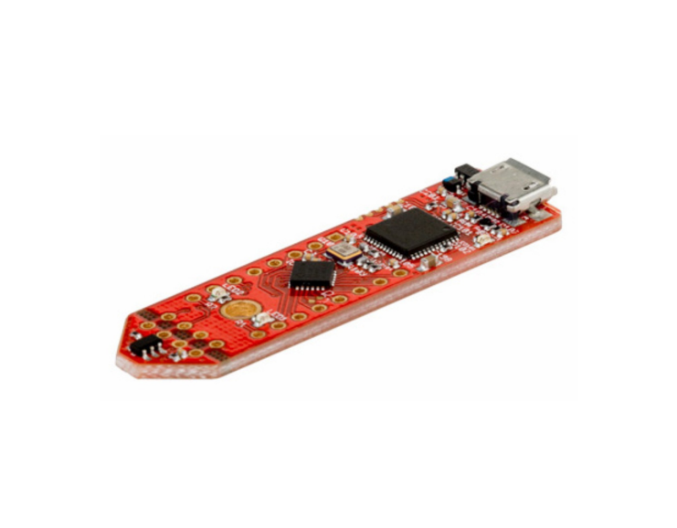
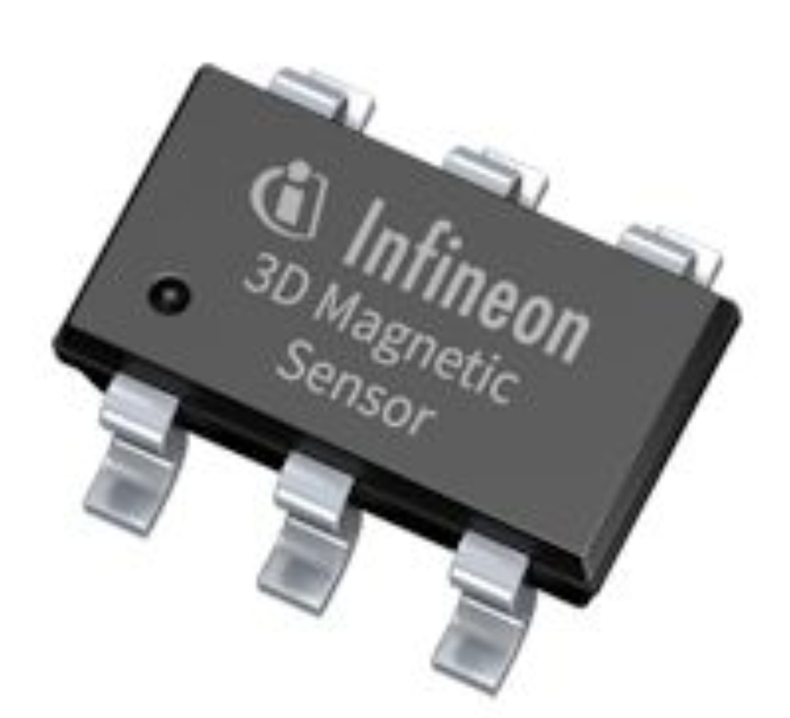
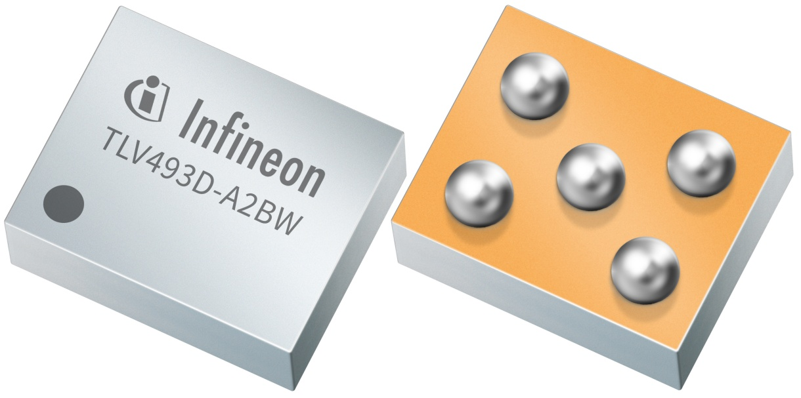
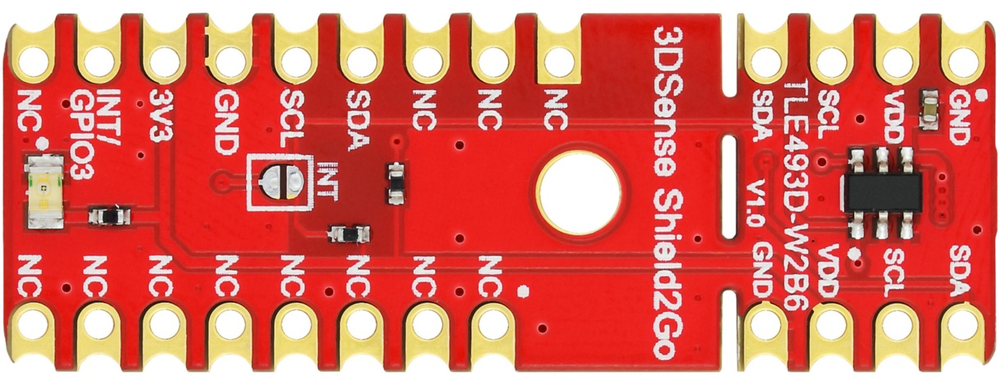
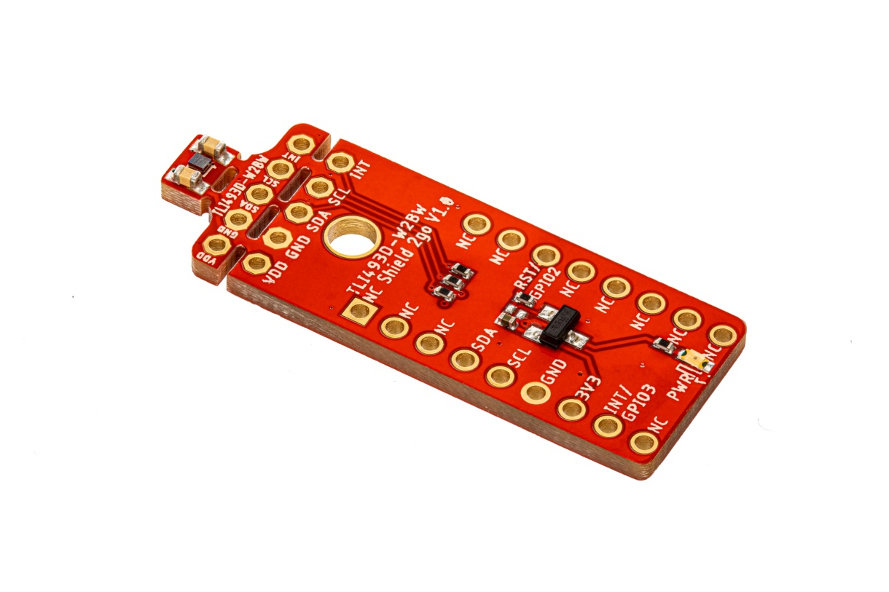

# XENSIV™ 3D Magnetic Sensor TLx493D Arduino Library

Arduino Library of Infineon's [**XENSIV™ 3D Magnetic Sensor TLx493D**](https://www.infineon.com/cms/en/product/sensor/magnetic-sensors/magnetic-position-sensors/3d-magnetics/) family.

### Supported Sensor Platforms

<table>
    <tr>
        <td></td>
        <td></td>
        <td></td>
        <td></td>
    </tr>
    <tr>
        <td style="test-align : center"><a href="https://www.infineon.com/cms/en/product/evaluation-boards/s2go_3d-sense_tlv493d/">XENSIV™ TLV493D-A1B6 Shield2Go</a></td>
        <td style="test-align : center"><a href="https://www.infineon.com/cms/en/product/evaluation-boards/tlv493d-a1b6-ms2go/">XENSIV™ TLV493D-A1B6 2GO kit</a></td>
        <td style="test-align : center"><a href="https://www.infineon.com/cms/en/product/sensor/magnetic-sensors/magnetic-position-sensors/3d-magnetics/tle493d-a2b6/">XENSIV™ TLE493D-A2B6</a></td>
        <td style="test-align : center"><a href="https://www.infineon.com/cms/en/product/sensor/magnetic-sensors/magnetic-position-sensors/3d-magnetics/tli493d-a2b6/">XENSIV™ TLI493D-A2B6</a></td>
    </tr>
    <tr>
        <td></td>
        <td></td>
        <td></td>
        <td></td>
    </tr>
    <tr>
        <td style="test-align : center"><a href="https://www.infineon.com/cms/en/product/sensor/magnetic-sensors/magnetic-position-sensors/3d-magnetics/tlv493d-a2bw/">XENSIV™ TLV493D-A2BW</a></td>
        <td style="test-align : center"><a href="https://www.infineon.com/cms/en/product/evaluation-boards/s2go_3d_tle493dw2b6-a0/">XENSIV™ TLE493D-W2B6 Shield2Go</a></td>
        <td style="test-align : center"><a href="https://www.infineon.com/cms/en/product/evaluation-boards/tle493d-w2b6-ms2go/">XENSIV™ TLE493D-W2B6 2GO kit</a></td>
        <td style="test-align : center"><a href="">XENSIV™ TLI493D-W2BW Shield2Go</a></td>
    </tr>
    <tr>
        <td></td>
    </tr>
    <tr>
        <td style="test-align : center"><a href="">XENSIV™ TLE493D-P2B6 2GO kit</a></td>
    </tr>
</table>

### Getting Started

Find a detailed getting started guide for the supported XENSIV™ 3D Magnetic TLX493D Sensors [here](https://arduino-xensiv-3d-magnetic-sensor-tlx493d.readthedocs.io/en/latest/quickstart-guide.html).

### Library Installation

Look for `XENSIV 3D Magnetic Sensor TLx493D` in the Arduino library manager in order to install this library. An alternative installation method can be found [here](https://arduino-xensiv-3d-magnetic-sensor-tlx493d.readthedocs.io/en/latest/lib-install.html).

### API Reference

Discover all the API features and functions in the [API Reference](https://arduino-xensiv-3d-magnetic-sensor-tlx493d.readthedocs.io/en/latest/api-ref.html) section of the documentation.

### More Information

More information can be found within the library [docs](https://arduino-xensiv-3d-magnetic-sensor-tlx493d.readthedocs.io/en/latest/index.html).

### License

See the [LICENSE](LICENSE.md) file for more details about the license.
