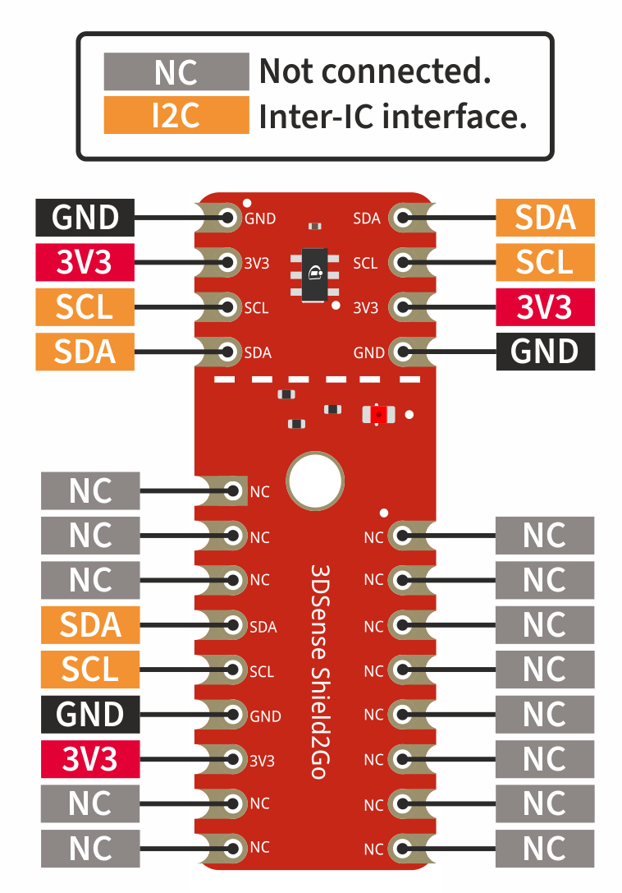
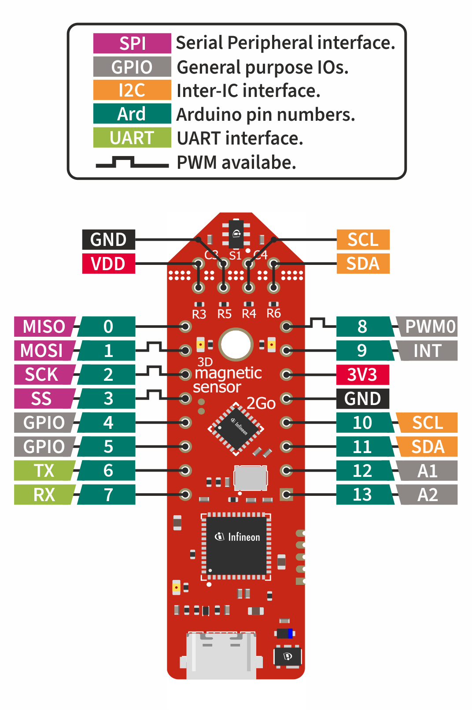
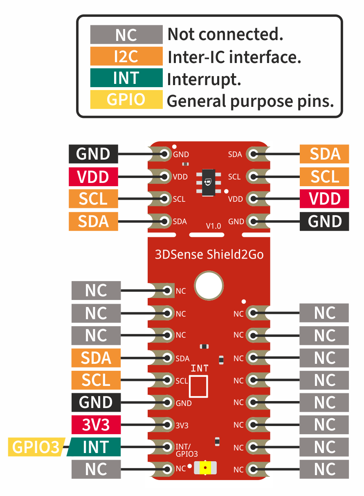
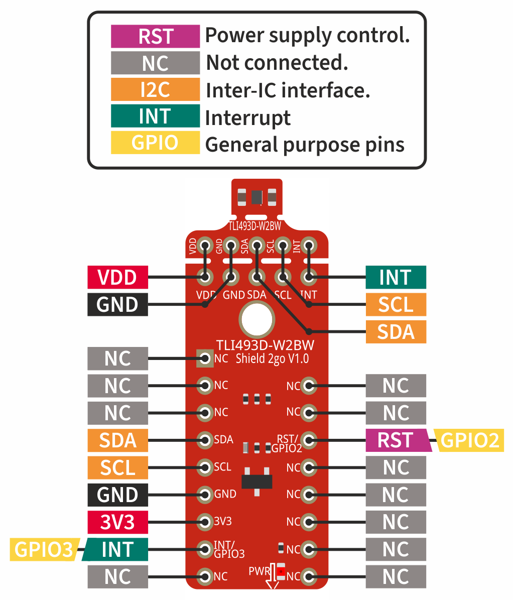

.. _hw-platforms:

Hardware Platforms
==================

Supported Sensor Boards
-----------------------

This library supports almost the complete XENSIV™ 3D Magnetic Sensors Tlx493d family. This includes the Shield2Go boards, as well as the 2GO Kits of the sensors. Following you will see a list of boards which are supported by this library.

XENSIV™ TLV493D-A1B6 Shield2Go
""""""""""""""""""""""""""""""

.. image:: img/TLV493D_A1B6_2GO.jpg
    :width: 200

* `Product Page - XENSIV™ 3D Magnetic Sensor TLV493D-A1B6 Shield2Go <https://www.infineon.com/cms/en/product/evaluation-boards/s2go_3d-sense_tlv493d/>`_
* `Quick Start Guide - XENSIV™ 3D Magnetic Sensor TLV493D-A1B6 Shield2Go <https://www.infineon.com/dgdl/Infineon-TLV493D-A1B6-3DSense-Shield2Go_QS_July18-GS-v01_00-EN.pdf?fileId=5546d46264a8de7e0164c5e70a39048e>`_

Pinout Diagram
^^^^^^^^^^^^^^

Pin Description
^^^^^^^^^^^^^^^
.. list-table:: 
    :header-rows: 1

    * - Pin Name
      - Description
    * - 3V3
      - 3.3 V supply input
    * - VDD
      - Power supply pin - do not apply more than 3.3 V
    * - GND
      - Supply and signal ground
    * - SCL
      - Serial clock line of the I2C bus
    * - SDA
      - Serial data line of the I2C bus

----------------------------------------------------------------------

XENSIV™ TLV493D-A1B6 2GO Kit
""""""""""""""""""""""""""""

.. image:: img/TLV493D_A1B6_MS2GO.png
    :width: 200

* `Product Page - XENSIV™ 3D Magnetic Sensor TLV493D-A1B6 2GO Kit  <https://www.infineon.com/cms/en/product/evaluation-boards/tlv493d-a1b6-ms2go/>`_
* `User Manual - XENSIV™ 3D Magnetic Sensor TLV493D-A1B6 2GO Kit <https://www.infineon.com/dgdl/Infineon-Infineon-3DMS2GO_TLv493D-A1B6-UM-v01_02-EN-UM-v01-UserManual-v01_02-EN.pdf?fileId=5546d462525dbac40152ac4ca1d318c2>`_

Pinout Diagram
^^^^^^^^^^^^^^

Pin Description
^^^^^^^^^^^^^^^

.. list-table:: 
    :header-rows: 1

    * - Pin Name
      - Description
    * - 3V3
      - 3.3 V supply input
    * - VDD
      - Power supply pin - do not apply more than 3.3 V
    * - GND
      - Supply and signal ground
    * - SCL
      - Serial clock line of the I2C bus
    * - SDA
      - Serial data line of the I2C bus
    * - TX
      - UART transmit pin
    * - RX
      - UART receive pin
    * - MISO
      - MISO pin of the SPI bus
    * - MOSI
      - MOSI pin of the SPI bus
    * - SCK
      - Clock pin of the SPI bus
    * - SS
      - Slave select pint of the SPI bus
    * - GPIO / 4
      - General purpose pin (Arduino pin number 4)
    * - GPIO / 5
      - General purpose pin (Arduino pin number 5)
    * - PWM0 / 8
      - Pulse-width modulation pin 0 (Arduino pin number 8)
    * - INT / 9
      - Interrupt pin (Arduino pin number 9)
    * - A1 / 12
      - Analog pin 1 (Arduino pin number 12)
    * - A2 / 13
      - Analog pin 2 (Arduino pin number 13)   
    
-----------------------------------------------------------------------

XENSIV™ TLE493D-W2B6 Shield2Go
""""""""""""""""""""""""""""""

.. image:: img/TLE493D_W2B6_2GO.jpg
    :width: 200

* `Product Page - XENSIV™ TLE493D-W2B6 Shield2Go <https://www.infineon.com/cms/en/product/evaluation-boards/s2go_3d_tle493dw2b6-a0/>`_

Pinout Diagram
^^^^^^^^^^^^^^

Pin Description
^^^^^^^^^^^^^^^

.. list-table:: 
    :header-rows: 1

    * - Pin Name
      - Description
    * - 3V3
      - 3.3 V supply input
    * - VDD
      - Power supply pin - do not apply more than 3.3 V
    * - GND
      - Supply and signal ground
    * - SCL
      - Serial clock line of the I2C bus
    * - SDA
      - Serial data line of the I2C bus
    * - INT / GPIO3
      - Interrupt pin
       
----------------------------------------------------------------------

XENSIV™ TLE493D-W2B6 2GO Kit
""""""""""""""""""""""""""""

.. image:: img/TLV493D_A1B6_MS2GO.png
    :width: 200

* `Product Page - XENSIV™ TLE493D-W2B6 2GO Kit <https://www.infineon.com/cms/en/product/evaluation-boards/tle493d-w2b6-ms2go/>`_
* `User Manual - XENSIV™ TLE493D-W2B6 2GO Kit <https://www.infineon.com/dgdl/Infineon-Infineon-3DMS2GO_TLE493D-W2B6-UM-v01_01-EN-UserManual-v01_01-EN.pdf?fileId=5546d462636cc8fb016418342fea3f54>`_
  
Pinout Diagram
^^^^^^^^^^^^^^

Pin Description
^^^^^^^^^^^^^^^

.. list-table:: 
    :header-rows: 1

    * - Pin Name
      - Description
    * - 3V3
      - 3.3 V supply input
    * - VDD
      - Power supply pin - do not apply more than 3.3 V
    * - GND
      - Supply and signal ground
    * - SCL
      - Serial clock line of the I2C bus
    * - SDA
      - Serial data line of the I2C bus
    * - TX
      - UART transmit pin
    * - RX
      - UART receive pin
    * - MISO
      - MISO pin of the SPI bus
    * - MOSI
      - MOSI pin of the SPI bus
    * - SCK
      - Clock pin of the SPI bus
    * - SS
      - Slave select pint of the SPI bus
    * - GPIO / 4
      - General purpose pin (Arduino pin number 4)
    * - GPIO / 5
      - General purpose pin (Arduino pin number 5)
    * - PWM0 / 8
      - Pulse-width modulation pin 0 (Arduino pin number 8)
    * - INT / 9
      - Interrupt pin (Arduino pin number 9)
    * - A1 / 12
      - Analog pin 1 (Arduino pin number 12)
    * - A2 / 13
      - Analog pin 2 (Arduino pin number 13)  

----------------------------------------------------------------------

XENSIV™ TLI493D-W2BW Shield2Go
^^^^^^^^^^^^^^^^^^^^^^^^^^^^^^

.. image:: img/TLI493D_W2BW_2GO.jpg
    :width: 200

* `Product Page - XENSIV™ TLI493D-W2BW Shield2Go <https://www.infineon.com/cms/en/product/evaluation-boards/s2go_3d_tli493dw2bw-a0/>`_
* `Quick Start Guide - XENSIV™ TLI493D-W2BW Shield2Go <https://www.infineon.com/dgdl/Infineon-TLI493D-W2BW_Shield2Go-GettingStarted-v01_00-EN.pdf?fileId=5546d462737c45b9017395f019797123>`_

Pinout Diagram
^^^^^^^^^^^^^^

Pin Description
^^^^^^^^^^^^^^^

.. list-table:: 
    :header-rows: 1

    * - Pin Name
      - Description
    * - 3V3
      - 3.3 V supply input
    * - VDD
      - Power supply pin - do not apply more than 3.3 V
    * - GND
      - Supply and signal ground
    * - SCL
      - Serial clock line of the I2C bus
    * - SDA
      - Serial data line of the I2C bus
    * - RST /  GPIO2
      - Power control pin
    * - INT / GPIO3
      - Interrupt pin

----------------------------------------------------------------------

XENSIV™ TLE493D-P2B6 2GO Kit
""""""""""""""""""""""""""""

.. image:: img/TLV493D_A1B6_MS2GO.png
    :width: 200

* `Product Page - XENSIV™ TLE493D-P2B6 2GO Kit <https://www.infineon.com/cms/en/product/evaluation-boards/tle493d-p2b6ms2go/>`_
* `User Manual - XENSIV™ TLE493D-P2B6 2GO Kit <https://www.infineon.com/dgdl/Infineon-3DMS2GO_TLE493D-P2B6-UserManual-v01_00-EN.pdf?fileId=5546d4627aa5d4f5017aaa6e84cb0eca>`_

Pinout Diagram
^^^^^^^^^^^^^^

Pin Description
^^^^^^^^^^^^^^^

.. list-table:: 
    :header-rows: 1

    * - Pin Name
      - Description
    * - 3V3
      - 3.3 V supply input
    * - VDD
      - Power supply pin - do not apply more than 3.3 V
    * - GND
      - Supply and signal ground
    * - SCL
      - Serial clock line of the I2C bus
    * - SDA
      - Serial data line of the I2C bus
    * - TX
      - UART transmit pin
    * - RX
      - UART receive pin
    * - MISO
      - MISO pin of the SPI bus
    * - MOSI
      - MOSI pin of the SPI bus
    * - SCK
      - Clock pin of the SPI bus
    * - SS
      - Slave select pint of the SPI bus
    * - GPIO / 4
      - General purpose pin (Arduino pin number 4)
    * - GPIO / 5
      - General purpose pin (Arduino pin number 5)
    * - PWM0 / 8
      - Pulse-width modulation pin 0 (Arduino pin number 8)
    * - INT / 9
      - Interrupt pin (Arduino pin number 9)
    * - A1 / 12
      - Analog pin 1 (Arduino pin number 12)
    * - A2 / 13
      - Analog pin 2 (Arduino pin number 13)  

----------------------------------------------------------------------

Additional Supported Sensors
----------------------------

This library also supports the two following sensor variants:
* TLE493D A2B6
* TLI493D A2B6
* TLV493D A2BW
Since they are not available as Kit2Go or as Shield2Go we just listed them here, but they are supported by library. If you want to use one of these sensors in your project please refer to the corresponding data sheet for a pinout of the sensor.
  
.. _Supported HW:

Supported MCU Platforms
-----------------------

In principle, the library can be used with any Arduino compatible MCU platform, as long as its Arduino core is implemented with the `Arduino Reference Language <https://www.arduino.cc/reference/en/>`_. Below you will find a list of the boards which should be compatible with the library.

.. list-table::
    :header-rows: 1

    * - MCU Platforms
    * - `XMC 2Go <https://www.infineon.com/cms/de/product/evaluation-boards/kit_xmc_2go_xmc1100_v1/>`_
    * - `XMC1100 Boot Kit <https://www.infineon.com/cms/de/product/evaluation-boards/kit_xmc11_boot_001/>`_
    * - `XMC4700 Relax Kit <https://www.infineon.com/cms/de/product/evaluation-boards/kit_xmc47_relax_v1/>`_
    * - `XMC4700 Relax Lite Kit <https://www.infineon.com/cms/de/product/evaluation-boards/kit_xmc47_relax_lite_v1/>`_ 
    * - `Arduino Uno Rev3 <https://store.arduino.cc/products/arduino-uno-rev3>`_
    * - `Arduino Uno R4 Minima <https://store.arduino.cc/products/uno-r4-minima>`_

Verified MCU and Sensor Combinations
------------------------------------

In the following table you find an extensive list of examples we have verified. For each example we also mentioned the used MCU board. Please be aware that we can only guarantee that the library fully functions with these MCU and sensor combinations. But all the examples should work with any of the MCU boards mentioned above and the corresponding senors of these examples.

.. warning:: 
  Some of the examples have been tested with experimental boards. This means that you cannot buy these boards directly from Infineon. If you're really interested to try out these examples, you can order one of the available boards with the same sensor package and replace the sensor on the board with the desired one.

.. list-table::
  :header-rows: 1

  * - Status
    - Board Type
    - Sensor
    - Tests
    - Comment
  * - pass
    - Kit2Go
    - A1B6
    - Test suite, read_icc
    - arduino-cli 0.34.0 with xmc 2.2.0.
  * - pass
    - Kit2Go
    - A2B6
    - Test suite, read_icc
    - arduino-cli 0.34.0 with xmc 2.2.0.
  * - pass
    - Kit2Go
    - P2B6
    - Test suite, read_icc
    - arduino-cli 0.34.0 with xmc 2.2.0.
  * - pass
    - Kit2Go
    - W2B6
    - Test suite, read_icc
    - arduino-cli 0.34.0 with xmc 2.2.0.
  * - pass
    - Kit2Go
    - P3I8
    - Test suite, read_spi_sensor
    - arduino-cli 0.34.0 with xmc 2.2.0. Experimental board, which is not for sale yet.
  * - pass
    - S2Go
    - A1B6
    - read_iic_a1b6_extended_addresses
    - arduino-cli 0.34.0 with xmc 2.2.0.
  * - pass
    - S2Go
    - A2BW
    - Test suite
    - arduino-cli 0.34.0 with xmc 2.2.0. Experimental board with W2B6 as base board. Not for sale.
  * - pass
    - S2Go
    - W2B6
    - Test suite
    - arduino-cli 0.34.0 with xmc 2.2.0.
  * - pass
    - S2Go
    - W2BW
    - Test suite
    - arduino-cli 0.34.0 with xmc 2.2.0.
  * - pass
    - XMC4700 Relax Kit Lite
    - W2BW, W2B6, P3B6
    - read_3_different_iic_sensors
    - arduino-cli 0.34.0 with xmc 2.2.0.
  * - pass
    - XMC4700 Relax Kit Lite
    - W2B6
    - read_3_equal_iic_sensors
    - arduino-cli 0.34.0 with xmc 2.2.0.
  * - pass
    - XMC4700 Relax Kit Lite
    - W2BW
    - read_iic_sensor_with_wakeup
    - arduino-cli 0.34.0 with xmc 2.2.0.
  * - pass
    - S2Go
    - P3B6
    - Test suite
    - arduino-cli 0.34.0 with xmc 2.2.0. Experimental board with W2B6 as base board. Not yet for sale.
  * - pass
    - Uno R3
    - W2B6
    - read_iic
    - arduino-cli 0.34.0 with AVR 1.8.6 and Arduino IDE 2.3.2
  * - pass
    - Uno R3
    - W2BW
    - read_iic
    - arduino-cli 0.34.0 with AVR 1.8.6 and Arduino IDE 2.3.2
  * - pass
    - Uno R4 Minima
    - W2BW
    - Test suite, read_iic
    - arduino-cli 0.34.0 with UNO R4 and Arduino IDE 2.3.2