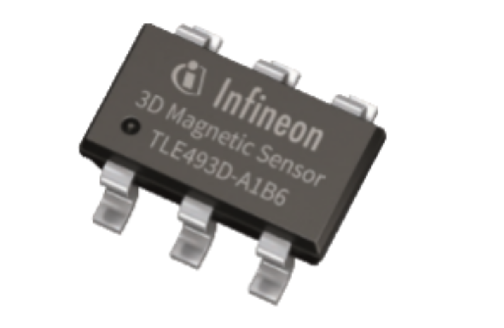

****
Home
****

Welcome to the |TM| library documentation! On this website you will find all the necessary information to get started with the TLx493D sensor family.

.. image:: img/Arduino_Logo.png
   :height: 150

.. image:: img/TLV493D_A2BW.jpg
   :height: 80

.. toctree::
   :maxdepth: 1
   :caption: Contents:

   self
   quickstart-guide
   hw-platforms
   lib-install
   examples
   api-ref
   
License
=======

Find the license for this library `here <https://github.com/Infineon/arduino-xensiv-3d-magnetic-sensor-tlx493d/blob/master/LICENSE.md>`_.

.. |TM| replace:: XENSIV™ 3D Magnetic Sensors TLx493D
.. _TM: https:://infineon.com/
