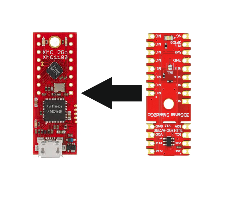
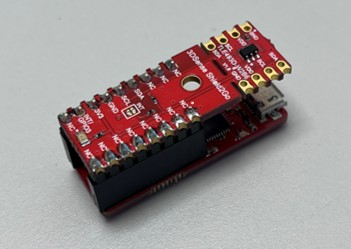
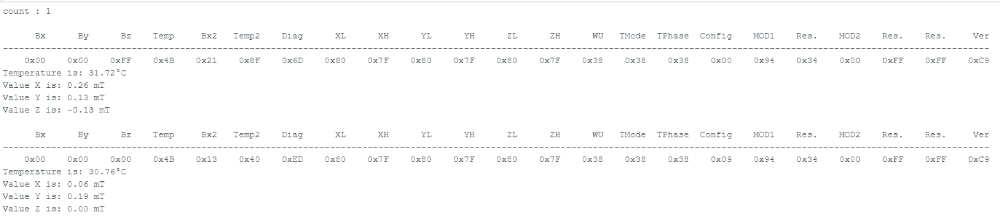

.. _quickstart-guide:

Quickstart Guide
================

In this quick tutorial we will go through one of the |TM| library examples, which is available for all the sensors supported by this Arduino library.
We will use the XMC 2Go as microcontroller, but you can choose any of the :ref:`supported platforms<Supported HW>` in order to get this example working.

Required Hardware
-----------------

.. list-table::
  :widths: 50 50
  :header-rows: 1

  * - Name
    - Picture
  * - `XENSIV™ 3D Magnetic Sensor TLE493D-W2B6 Shield2Go <https://www.infineon.com/cms/en/product/evaluation-boards/s2go_3d_tle493dw2b6-a0/>`_
    - .. image:: img/TLE493D_W2B6_2GO.jpg
          :height: 50
  * - `XMC 2Go <https://www.infineon.com/cms/de/product/evaluation-boards/kit_xmc_2go_xmc1100_v1/>`_ (only needed if you chose a shield 2Go)
    - .. image:: img/xmc2go.jpg
          :height: 60
  * - Magnet (diametrically magnetized)
    - For example something like `this <https://www.digikey.de/de/products/detail/radial-magnets-inc/8170/5400486>`_
  * - Pin headers (8 pins, male and female) 
    - For example something like `this <https://www.digikey.de/de/products/detail/te-connectivity-amp-connectors/5-146280-4/5008688>`_ 
  * - Micro-USB to USB-A cable
    - For example something like `this <https://www.digikey.de/de/products/detail/molex/0687840002/1952431>`_ 

Required Software
-----------------

- `Arduino IDE <https://www.arduino.cc/en/main/software>`_
- `XMC-for-Arduino <https://github.com/Infineon/XMC-for-Arduino>`_
- `XENSIV™ 3D Magnetic Sensors TLx493D Arduino Library <https://github.com/Infineon/arduino-xensiv-3d-magnetic-sensor-tlx493d.git>`_

Software Installation
---------------------

1. **Install the Arduino IDE**

If you are new to Arduino, please `download <https://www.arduino.cc/en/Main/Software>`_
the program and install it first.

1. **Install the XMC Boards**

The official Arduino boards are already available in the Arduino IDE, but other third party boards, like the Infineon MCUs, need to be explicitly included in order to use them. Follow the instructions in the `link <https://github.com/Infineon/XMC-for-Arduino?tab=readme-ov-file#installation-instructions>`_ to add the XMC MCU family to the Arduino IDE. Do not forget to install the the J-Link-Software as well. The steps to install the J-Link-Software are also provided in the link.

2. **Install the library**

In the Arduino IDE, go to the menu *Sketch > Include Library > Library Manager*. Type *XENSIV 3D Magnetic Sensor TLx493D*
and wait for the tool to find it. Click on *install* and give the IDE a moment to install the library.

Hardware Setup
--------------

For this example we will use the I2C interface of the MCU. In order to connect the sensor properly to the XMC 2Go you have to solder pins to the XMC 2Go as well as to the XENSIV™ 3D Magnetic Sensor TLE493D-W2B6. For the XMC 2Go you need female pin headers and for the sensor you need male pin headers. If the soldering is done we can stack the XENSIV™ 3D Magnetic Sensor TLE493D-W2B6 on top of the XMC 2Go. Please look at the picture below in order to plug the sensor correctly into the XMC 2Go.

Here is another picture how the complete setup should look like.

If that is done you just have to connect the USB cable to the XMC 2Go as well as to the computer and get ready to use your magnet.

Ready To Go!
------------

With everything prepared we're ready to flash the first library example to the microcontroller.
In order to do that you have to do the following steps in the Arduino IDE:

1. **Select the right board**

Once you have installed the XMC board family, you can select one of the supported boards from the menu: *Tools > Board > Infineon's XMC Microcontroller*. Or you can select the board in the drop down menu, if you're using the new Arduino IDE. Here, you have to click on *Select other board and port...*. In our case we have to choose the *XMC1100 XMC2Go* in order to select the correct board. Depending on which XMC-for-Arduino version you have installed the selection in the board menu can look a bit different.

2. **Open the example**

With the library installed in the Arduino IDE you can simply open one of the examples that are part of the library. To do that you have to go to the menu: *File > Examples > XENSIV 3D Magnetic Sensor TLx493D* and choose the example *read_iic_sensor*.

3. **Build and run the example**

Please make sure that you have chosen the right COM port. You can choose it from the menu: *Tool > Port* or again from the drop down menu (new Arduino IDE). If you're not sure that you have selected the correct COM port you can do a simple trick. Just remove the USB cable from your computer and check all the available COM ports. With that done connect the board again and check the available COM ports again. There should be a new one now that has not been there before, this port is the right one to choose.

Now we can use the *verify button* |ver-but| to check if the code is correct and compiles without errors. If the compilation is successful you can upload the sketch via the *upload button* |upl-but| to the XMC 2Go.

After the upload is complete open the serial monitor with the *serial monitor button* |ser-but|. If you just see a bunch of strange symbols, you probably forgot to choose the correct baudrate for the serial terminal. You can find the needed baudrate inside the :code:`Serial.begin()` function call of the Arduino-Sketch. If everything is correctly set, you should see the magnetic values of the measured magnetic field in X, Y, Z-direction, as well as the temperature on the serial monitor.

.. |ver-but| image:: img/ard-verify-button.png
  :width: 17

.. |upl-but| image:: img/ard-upload-button.png
  :width: 17

.. |ser-but| image:: img/ard-serial-button.png
  :width: 17

What's next?
------------

.. TODO: Link to API reference

This was only one of the available library examples. The other :ref:`examples <examples>` will show much more of the sensor's available functionality. If you need more details about the library functions check out the :ref:`API reference section <api-ref>` of this documentation.

.. |TM| replace:: XENSIV™ 3D Magnetic Sensors TLx493D
.. _TM: https:://infineon.com/